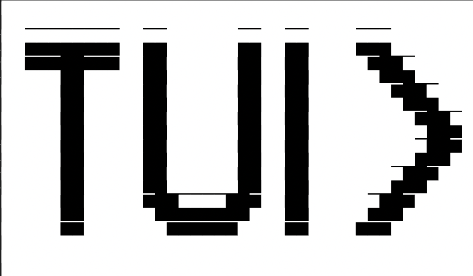
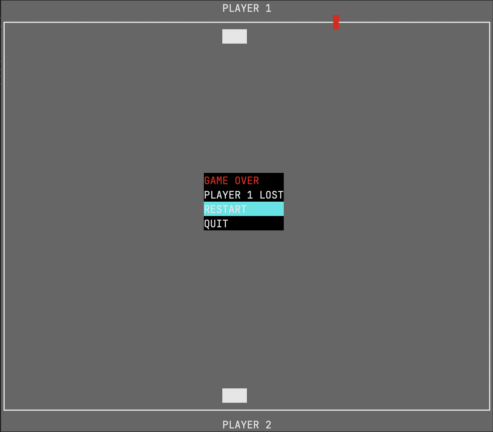
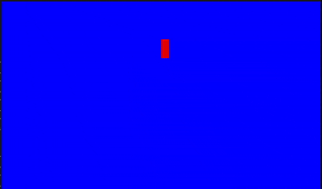

# TUI

A lightweight single-header terminal graphics library for ANSI-compatible terminals (528 semi-colons).

TUI provides a simple API for building terminal applications, animations, and small games using double-buffered rendering, Unicode text, image drawing, and SDL-style keyboard input.

## DEMO

<div align="center">


</div>
<div align="center">

</div>

## Features

* Single-header library
* Double-buffered rendering
* Unicode text output
* 16 ANSI foreground and background colors
* Text styles (bold, italic, underline, etc.)
* Border and rectangle drawing
* Image rendering
  * Nearest
  * Bilinear
  * Bicubic
  * Lanczos
* SDL-style keyboard input polling
* Frame rate limiter
* POSIX terminal backend using ANSI escape sequences

## Getting Started

In **one** source file:

```c
#define TUI_IMPLEMENTATION
#include "tui.h"
```

In every other source file:

```c
#include "tui.h"
```

Compile normally with your project.

## Example

```c
#define TUI_IMPLEMENTATION
#include "tui.h"

int main(void) {
    TerminalWindow term = createTermWindow(80, 24);

    fill_clr(BLACK, &term);
    move_cursor(10, 28, &term);
    set_color_fg(AQUA, &term);
    write_str("Hello, TUI!", &term);

    display(&term);
    show_cursor();
}
```

## Input

Keyboard input is polled through an `InputState` structure.

```c
InputState input;

enable_raw_mode();

while (1) {
    tui_poll_events(&input);

    if (input.pressed[TUIK_ESCAPE])
        break;
}
```

## Images

Images can be loaded using `stb_image` and rendered into any destination rectangle using one of the supported scaling filters.

```c
Image *img = load_image("image.png");

draw_image(img, &term, rect, IMG_BILINEAR, true);

destroy_image(&img);
```

## License

This project is licensed under the **MIT License**.

It also includes **stb_image**, which is distributed under its own permissive license. See the `stb_image.h` header for details.

